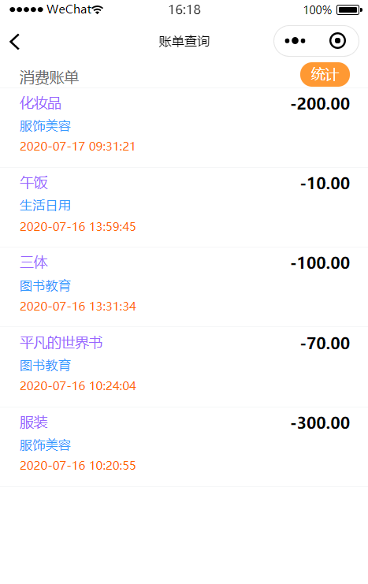
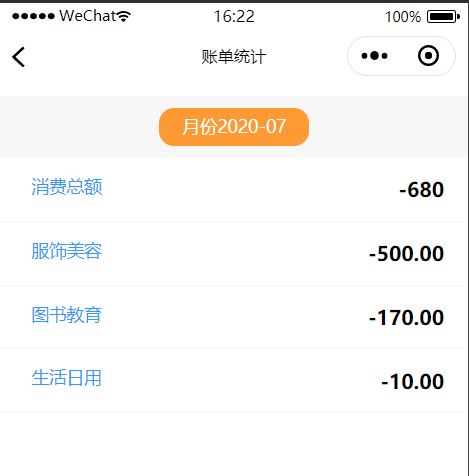

# 微信ChatAccounting小程序

## 该小程序目的是做一个AI聊天记账的小程序，功能包括聊天、记账、账单查询、偏好设置

该项目是由小组共同完成，我主要负责账单部分，账单部分分为两个方面：账单列表、账单统计。账单部分点击统计就能够进入账单统计页面。

### 1.账单列表

用户一进入账单页面，就能够看到最近的消费记录，所以，利用数据绑定以及列表渲染等，将账单js部分都写在了onload页面加载函数中。利用从缓存中获取数据来获取用户的唯一标识openid，为了避免wx.request请求函数先反应而wx.getStorage函数未反应的情况，将请求函数写在了wx.getStorage函数的成功回调函数中。

效果图显示如下：

### 2.账单统计

该功能主要是用户选择自己想要查看的月份，然后显示本月消费总金额以及每个分类的消费金额，js文件中的代码与account.js代码类似。

效果图显示如下：

